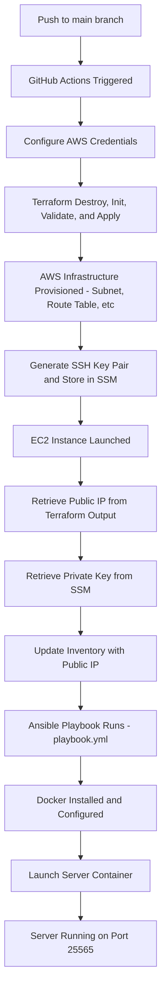

# Minecraft Server Deployment

## Purpose

This project and repository automates the configuration and deployment of a Minecraft server (Java Edition) on AWS.
The pipeline utilizes Terraform for provisioning, server configuration with Ansible, and runs the server in a Docker Container.
Github actions are incorporated to trigger these processes with each push to the main branch.
This structure eliminates manual configuration and ensures consistent deployments.


## Requirements

### Tools

The table below contains all tools that are required prior to deployment.
Official installation documentation is provided with each tool for ease of installation.

| Tool | Version | Documentation | Environment |
|------|---------|---------------|-------------|
| WSL | 2.0 + | [microsoft.com](https://learn.microsoft.com/en-us/windows/wsl/install) | Windows |
| Git | 2.53.0 + | [git-scm.com](https://git-scm.com/downloads) | WSL |
| Terraform | 1.15.5 + | [terraform.io](https://developer.hashicorp.com/terraform/install) | WSL |
| Ansible | 2.20.1 + | [ansible.com](https://docs.ansible.com/ansible/latest/installation_guide/intro_installation.html) | WSL |
| AWS CLI | 2.31.35 + | [aws.amazon.com](https://docs.aws.amazon.com/cli/latest/userguide/getting-started-install.html) | WSL |
| nmap | 7.99 + | [nmap.org](https://nmap.org/download) | Windows |
| GitHub Account | N/A | [github.com](https://github.com/signup) | Any |

> **Note:** Windows users must use Windows Subsystem for Linux (WSL) for Terraform, Ansible, and the AWS CLI. nmap should be installed and run on Windows directly.

### AWS Credentials

AWS Lab credentials are required and need to be configured before deployment.
Credentials can be found in the Learner Lab module under AWS details. 

To configure the credentials in WSL: 
```bash
export AWS_ACCESS_KEY_ID="access-key"
export AWS_SECRET_ACCESS_KEY="secret-key"
export AWS_SESSION_TOKEN="session-token"
```

> **Note:** Credentials expire each session, so they need to be exported before any AWS or Terraform commands are run.


### GitHub Secrets

The secrets in the table below need to be configured in the cloned GitHub repository before anything can run. 

You can adjust these by going to **Settings --> Secrets and Variables --> Actions --> New Repository Secret**

These must be updated everytime the lab credentials expire. 

| Secret | Description |
|--------|-------------|
| `AWS_ACCESS_KEY_ID` | AWS Learner Lab access key |
| `AWS_SECRET_ACCESS_KEY` | AWS Learner Lab secret key |
| `AWS_SESSION_TOKEN` | AWS Learner Lab session token |


## Pipeline Overview

On each push to the main branch, GitHub Actions triggers the deployment pipeline. 

AWS credentials will be configured from the GitHub secrets provided. Terraform is then run, destroying any existing infrastructure prior to provisioning new resources. These new resources include a VPC, subnet, internet gateway, route table, security group, and the EC2 instance. See the note below for more information on the destruction and recreation of resources. Terraform also creates an SSH key pair and securely stores the private key in AWS SSM parameter store. 

After the EC2 instance is configured and launched, the public IP and private key is retreived. Ansible then utilizes these assets to connect to the instance and run the Ansible playbook (playbook.yml). This action installs Docker, copies the Docker Compose file, and configures a systemd service which manages the server container. The server is configured to restart automatically on each reboot and shutdown cleanly when stopped. 

At the end of this deployment pipeline, the server will be provisioned, configured, launched, and accessible on port 25565. 

> **Note:** Each deployment destroys and recreates all infrastructure. Back up any
> Minecraft world data from `/minecraft/data` on the EC2 instance before pushing
> to `main` if this issue is a concern.


The flow chart below is a broad outline of the stages of deployment: 




## Tutorial

The tutorial below is instructions for deploying the server on a local Windows machine.

### 1. Clone the Repository

To start, clone the repository to your local machine:

```bash
git clone https://github.com/TomPi-22/minecraft-project2.git
cd minecraft-project2
```

### 2. Configure AWS Credentials

An essential step is to ensure the correct and valid AWS lab credentials are being utilized. 

These can be found and copied from the Learner Lab module **AWS Details** tab. 

After finding the credentials, copy and paste them in these commands: 

```bash
export AWS_ACCESS_KEY_ID="unique-access-key"
export AWS_SECRET_ACCESS_KEY="unique-secret-key"
export AWS_SESSION_TOKEN="unique-session-token"
```

### 3. Configure GitHub Secrets

To properly configure the GitHub Secrets previously noted in the Requirements section, utilize the same values from the sub-section above. 

To add the credentials and apply each secret, navigate to **Settings --> Secrets and Variables --> Actions --> New Repository Secret** and add the following secrets:

| Secret | Description |
|--------|-------------|
| `AWS_ACCESS_KEY_ID` | AWS Learner Lab access key |
| `AWS_SECRET_ACCESS_KEY` | AWS Learner Lab secret key |
| `AWS_SESSION_TOKEN` | AWS Learner Lab session token |

### 4. Deploy the Server

As mentioned before, pushing to the main branch triggers the deployment pipeline: 

```bash
git push origin main
```

GitHub Actions, located in the `.github/workflows/actions.yml`, will run the pipeline automatically. Progress and/or status of the deployment can be viewed under the **Actions** tab in the GitHub repository. 

### 5. Verify the Server

After the pipeline has been deployed and the server has successful status visible in the **Actions** tab, copy the server's public IP that is accessible after expanding **Add server IP to inventory (hosts.ini)** in the deployment logs. 

In Windows Powershell, the following **nmap** command can be used to verify the server is live and accessible:

```bash
nmap -sV -Pn -p T:25565 "replace with public IP"
```

A successful deployment will deliver the following output: 

| Port | State | Service | Version |
|------|-------|---------|---------|
| 25565/tcp | open | minecraft | - |

The server can be connected to using the Multiplayer menu options in a Java Edition version of Minecraft and entering the Public IP address obtained in the section above. 


## Resources

### Terraform

**General / Styling**
- [Terraform Style Guide](https://developer.hashicorp.com/terraform/language/style#code-formatting)

**variables.tf**
- [Terraform AWS Get Started](https://developer.hashicorp.com/terraform/tutorials/aws-get-started/aws-manage)
- [terraform-aws-vpc variables.tf](https://github.com/terraform-aws-modules/terraform-aws-vpc/blob/master/variables.tf)

**sec_group.tf**
- [AWS Security Group Resource](https://registry.terraform.io/providers/hashicorp/aws/latest/docs/resources/security_group)

**resources.tf**
- [AWS Instance Resource](https://registry.terraform.io/providers/hashicorp/aws/latest/docs/resources/instance)
- [AWS Configuration Reference](https://registry.terraform.io/providers/hashicorp/aws/latest/docs#aws-configuration-reference)
- [AWS Internet Gateway Resource](https://registry.terraform.io/providers/hashicorp/aws/latest/docs/resources/internet_gateway)
- [AWS Subnet Resource](https://registry.terraform.io/providers/hashicorp/aws/latest/docs/resources/subnet.html)
- [Terraforming Resources into Modules](https://medium.com/@the.nick.miller/terraforming-resources-into-modules-221f06fffef7)

**outputs.tf**
- [Terraform Output Values](https://developer.hashicorp.com/terraform/language/values/outputs)

---

### Docker

**compose.yaml**
- [Setting up a Java Edition Server](https://minecraft.wiki/w/Tutorial:Setting_up_a_Java_Edition_server)
- [Docker Compose Application Model](https://docs.docker.com/compose/intro/compose-application-model/)

---

### Ansible

**hosts.ini**
- [Ansible INI Inventory](https://docs.ansible.com/projects/ansible/latest/collections/ansible/builtin/ini_inventory.html)
- [Ansible Inventory Guide](https://docs.ansible.com/projects/ansible/latest/inventory_guide/intro_inventory.html#intro-inventory)
- [StrictHostKeyChecking](https://linux-audit.com/ssh/config/client/option-stricthostkeychecking/)

**playbook.yml**
- [How to Use Ansible to Install Docker on Ubuntu](https://www.digitalocean.com/community/tutorials/how-to-use-ansible-to-install-and-set-up-docker-on-ubuntu-20-04)
- [Ansible Systemd Module](https://docs.ansible.com/projects/ansible/latest/collections/ansible/builtin/systemd_module.html)
- [Ansible YAML Essentials](https://developers.redhat.com/learning/learn:ansible:yaml-essentials-ansible/resource/resources:ansible-yaml-file-syntax-and-structure)

**minecraft-service.txt**
- [Traefik Docker Systemd](https://nickhuber.ca/blog/traefik-docker-systemd-v2)
- [Systemd Service Example](https://gist.github.com/mosquito/b23e1c1e5723a7fd9e6568e5cf91180f)
- [Docker Compose CLI Reference](https://docs.docker.com/reference/cli/docker/compose/)

---

### GitHub Actions

**actions.yml**
- [CI/CD Pipeline for Terraform](https://terrateam.io/blog/ci-cd-pipeline-for-terraform)
- [GitHub Actions Workflow Syntax](https://docs.github.com/en/actions/reference/workflows-and-actions/workflow-syntax)
